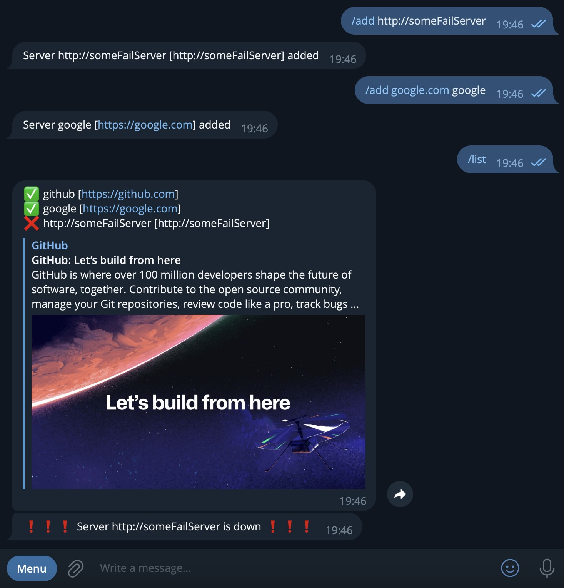

# Server Health Check Telegram Bot

## Introduction

The Server Health Check Telegram Bot monitors the status of your servers and sends notifications to Telegram if the
server is unavailable.

Bot sends requests to the servers and checks the response code. If the response code is not 200, the bot
sends a message to the specified chat.

## Installation and Usage

### Docker

To run from Docker, you need to do the following:

1. Install [Docker](https://docs.docker.com/get-docker/)
   and [Docker Compose](https://docs.docker.com/compose/install/).
2. Create your bot and get a token from [@BotFather](https://t.me/BotFather).
3. Get `chat_id` from [@userinfobot](https://t.me/userinfobot).
4. Set mandatory
   env [docker-compose.yml](/docker/docker-compose.yml): ``TELEGRAM_TOKEN``, ``TELEGRAM_CHAT`` and args ``super``.
   https://github.com/Romancha/server-healthcheck-telegram-bot/blob/f3eaf9efbc384083520d3343f1f48560ec211fb3/docker/docker-compose.yml#L1-L14
5. Configure the volumes in `docker-compose.yml` to persist servers list.
6. Run command ``docker-compose up -d``.

### From source

You can also run the bot from source code, build Go binary and run it.

## Configuration

| Param           | Description                                                                                                 |
|-----------------|-------------------------------------------------------------------------------------------------------------|
| TELEGRAM_TOKEN  | Telegram bot token, take from [@BotFather](https://t.me/BotFather)                                          |
| TELEGRAM_CHAT   | Chat ID where the bot will send messages. [@userinfobot](https://t.me/userinfobot) Can help to get chat id  |
| ALERT_THRESHOLD | The number of failed requests after which the bot will send a notification. Default ``3``                   |
| CHECKS_CRON     | [Cron](https://en.wikipedia.org/wiki/Cron) with seconds to checks server status. Default ``*/30 * * * * *`` |
| DEBUG           | Enable debug mode. Default ``false``                                                                        |

## Commands

| Command           | Description                                                    |
|-------------------|----------------------------------------------------------------|
| /add [url] [name] | Add server to monitor. For example: ``/add github.com github`` |
| /remove [name]    | Remove server from monitor. For example: ``/remove github``    |
| /removeAll        | Remove all servers from monitor                                |
| /list             | Show list of monitored servers                                 |

## Contributing

We welcome contributions to improve this project.

## License

This project is licensed under the Apache License 2.0 - see the [LICENSE](LICENSE) file for details.